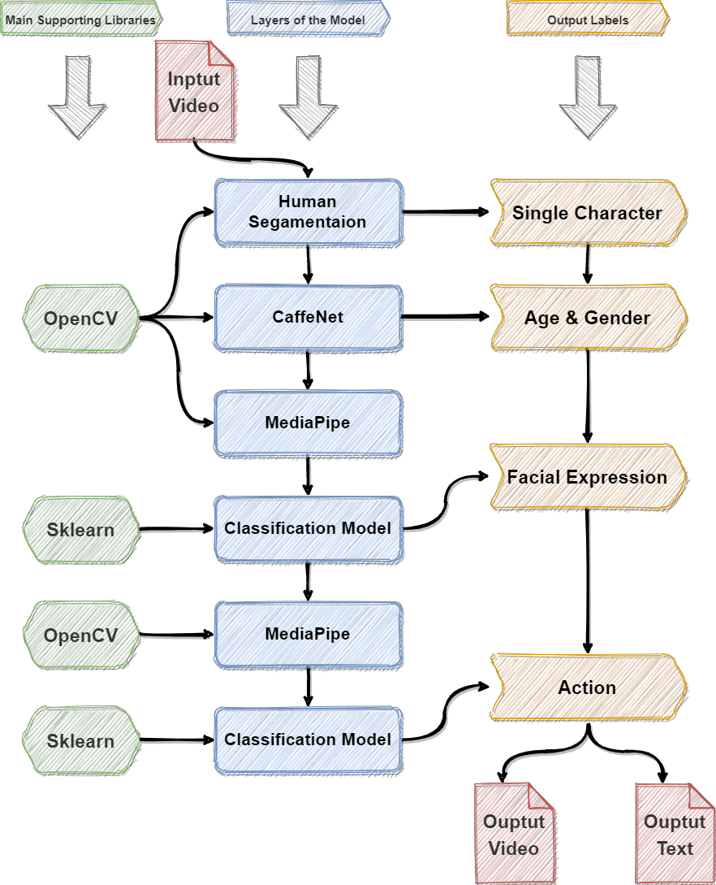

# 21-S1-2-C-Cinema
ANU Tech Launcher Project 21-S1-2-C-Cinema
User Manual
# Check User Manual.pdf for details （In folder “00_Code to be delivered”）
1. How to use trained model to process new videos
1.1 Operation guide
The main script of the project is Detect_main.py. It contains three functions, which are used to detect age and gender, facial expressions and action behaviours. You only need to run this script and enter the path of the source video in the console to get the final output.
In the three functions in Detect_main.py, you can set a Boolean value as their parameters. When the value is True, you can see the results of real-time processing. When the value is False, you can omit the real-time monitoring to improve the processing speed.
After processing, the labelled video is saved as output_body.mp4, and all label information is saved in all_labels.txt. These files are all saved in the same directory of this script.
Some other files will also be generated. age+gender.mp4 is an output video that only contains age and gender information; output_facial.mp4 contains age and gender information and facial expression information; every time the code is re-run, all the videos mentioned above will be overwritten.
In this delivery version, we pre-set some labels based on some video sources provided by the client, and trained the model based on these labels:
•	Facial expressions: friendly, cool
•	Actions: speaking, push-up, squat-up
1.2 Schematic diagram of the running structure 
 
Please note that in the above chart, the function of human segmentation is not integrated in Detect_main.py due to its poor performance. We will fix this problem in the development of subsequent versions. However, you may still run human-counting-project-code.py to see the processed outcome.

2. How to add customized new labels and train the model
Among the three main functions of this algorithm, namely gender and age detection, expression detection and motion detection, gender detection uses an open-source pre-training model developed by MIT. Therefore, when the label structure changes, this part of the model does not need to be retrained. The following description will focus on expression detection and motion detection.
2.1 Initialize training and validation datasets
If there is no existing label in the current model, or the previous data set has been lost, it needs to be initialized before the data set is created.
At this time, you need to run Initial_Body_Samples.py and Initial_Ficial_Samples.py. These two scripts will create two files in the same directory, body_coords.csv and facial_coords.csv. They store schemas that comply with the Mediapipe action and facial coordinate rules.
2.2 Add training and verification video data to the dataset
For the training of the motion detection model, after initializing the database, first enter the label name of the video you are going to put into the model for training in the sixth line in Build_Body_Samples.py. For example, if the video shows a person running, "running" should be entered here. Then run Build_Body_Samples.py and enter the path of the video in the console. This script will use Mediapipe to extract all the key points of the character's body in the video and write it into body_coords.csv.
Before doing this, please make sure body_coords.csv exists. If this file does not exist, please refer to 2.1 to initialize the file. When the file exists, it does not need to be re-initialized.
The processing of the facial expression detection model is basically the same as the processing of the action detection model described above, just run Build_Facial_Samples.py in the same order of operations.
2.3 Train a classification model
For the motion detection model, when you have the data set, you only need to run Train_Body_Model.py to train the four classification models in Sklearn at the same time. After the run, the verification accuracy of the four models will be printed in the console. Please select the code of the model with the highest accuracy and fill in the corresponding position in the last line (line 34) of this script. For example, if "rf" has the highest score in the console, the last line of the script should be: pickle.dump(fit_models['rf'], f). 
Then please run this script again. In the second run, the command on the last line of the script will store the trained model in body_exp.pkl.
The processing of the facial expression detection model is basically the same as the processing of the action detection model described above, just run Train_Facial_Model.py in the same order of operations.
